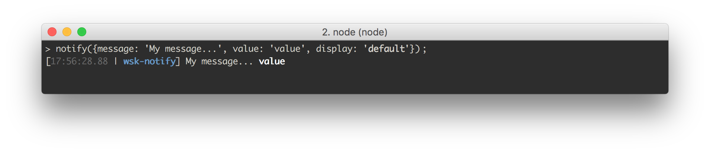
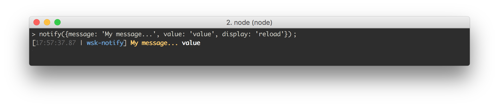
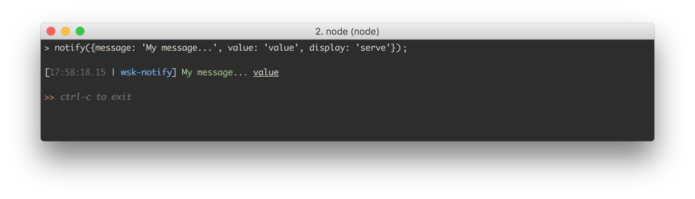
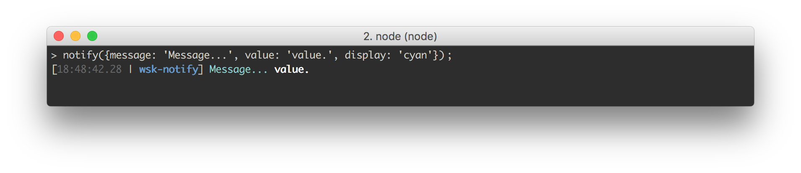
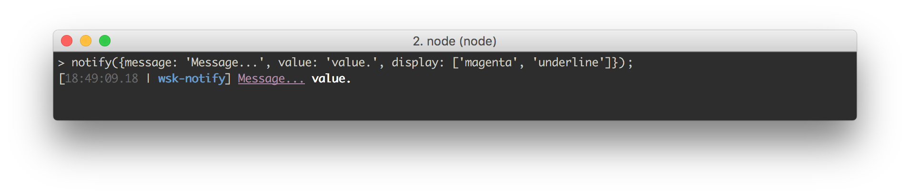
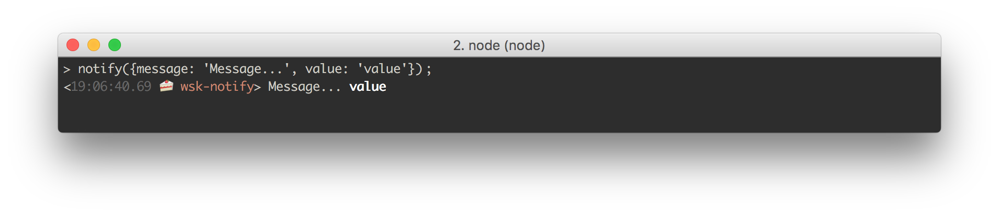

wsk-notify [](https://bloomberg.github.io/wsk-notify)
===

[](https://travis-ci.org/bloomberg/wsk-notify)
[](https://coveralls.io/github/bloomberg/wsk-notify?branch=master)
[](https://www.npmjs.com/package/wsk-notify)
[](https://github.com/Flet/semistandard)

> Simple, customizable console notifications. Used in the [wsk](https://bloomberg.github.io/wsk) build system.

* [Installation](#installation)
* [Usage](#usage)
* [Examples](#examples)
* [Displays & Styling](#displays--styling)
  - [Default Displays](#default-displays)
  - [Display Options](#display-options)
  - [Creating Your Own Display Styles With A `.notifyrc` File](#creating-your-own-display-styles-with-a-notifyrc-file)
  - [Extending Existing Display Styles](#extending-existing-display-styles)
* [A Note On Style Inheritance](#a-note-on-style-inheritance)
* [Groups](#groups)
* [Styling The Prefix](#styling-the-prefix)
* [Other `.notifyrc` Options](#other-notifyrc-options)
* [Specifying An Alternate `.notifyrc`](#specifying-an-alternate-notifyrc)
* [Shorthand](#shorthand)
* [Piping On The Command Line](#piping-on-the-command-line)
* [Clock](#clock)
* [Contributors](#contributors)
* [License](#license)

## Installation

```
npm install --save wsk-notify
```

## Usage

Use the `notify` function to create formatted console messages. Simple usage:

```js
var notify = require('wsk-notify');

notify({
  message: 'A description of what I did...',
  value: 'The file acted upon or the result of what happened'
});
```

Gives you:


The notification has three parts:

1. Prefix (the timestamp and base directory name)
2. Message (`message`)
3. Value (`value`)

Both `message` and `value` are optional, in case you only need one of them. They are functionally equivalent. The only difference is `value` gets bolded by default.

You can also pass a list, shown here using the [shorthand notation](#shorthand).

```js
notify([
  {m: 'First message',  v: 'File one'},
  {m: 'Second message', v: 'File two'}
]);
```

If you've given notify a list of objects, or you're using [groups](#groups), it will return a list of notification strings. If you've given it a single object, it will return a single string.

## Examples

For a full setup, take a look at a [wsk example project](https://bloomberg.github.io/wsk.example), which uses this library to tell users when their build tasks have been completed. The different display styles allow you to establish a visual pattern of what steps have occurred in your build process:

1. A file change was detected (cyan)
2. That file was transformed, such as a Stylus file becoming a CSS file (magenta)
3. Our live reload server detected the new file and is now refreshing (bold yellow)


Here are a bunch of `compile` processes running:


And here is a watch process:


Learn more about the wsk build system [here](https://bloomberg.github.io/wsk).

This library isn't just for build processes, though. You could use it whenever you want to give timestamped notification and easily want to group notifications by color. For example, if you're scraping a number of web pages, you could give a notification when a site was visited and another style notification when a data file is written.

## Displays & Styling

If you don't specify a `display` style, you'll get the above: the timestamp is `gray`, the project root is `blue` and `bold`, the message is your default color and the value is bold.

Out of the box, you get a number of styles, called "displays". Use one like so:

```js
notify({
  message: 'My message...',
  value: 'value',
  display: 'compile' // Can be any of the following: 'compile', 'watch', 'error', 'change', 'add', 'reload', 'success', 'remove', 'serve'
});
```

You can also pass an `Error` object to the `error` key to get a stack trace. See the display gallery below for an example. Errors are run through [clean-stack](https://npmjs.com/package/clean-stack) to cut out some of the junk.

```js
function cb (err, response) {
  if (err) {
    notify({
      message: 'My message...',
      value: 'value',
      display: 'error', // This can be any display but 'error' will have it print in red.
      error: err
    });
  }
};
```

See the specifics of these styles under `defaultDisplays` in [`src/defaults/defaultNotifyrc.js`](src/defaults/defaultNotifyrc.js).

### Default Displays

**`default`**



**`compile`**


**`watch`**


**`warn`**, , uses console.warn


**`error`**, uses console.error


**`error` with an `Error` object to show stack**, uses console.error


**`change`**


**`remove`**


**`add`**


**`reload`**




**`success`**


**`serve`**



### Display options

The `display` field can be:

1. A name of a display, as shown above
2. A string or an array of chalk codes. This is shorthand for styling the `message`.
3. A full display object

For example:

```js
// Single color
notify({
  message: 'Message...',
  value: 'value',
  display: 'cyan'
});

// Multiple color
notify({
  message: 'Message...',
  value: 'value',
  display: ['magenta', 'underline']
});

// Custom display object
notify({
  message: 'Message...',
  value: 'value',
  display: {
    messageStyle: 'cyan',
    valueStyle: 'stripColor' // This removes existing styling. In this case it makes it not bolded.
  }
});
```

Gives you:





Here are the full options for the `display` object showing default values. Any attribute ending in `Style` can take a string or an array of strings of [chalk color, modifier or background color style](https://www.npmjs.com/package/chalk#styles).

```js
notify({
  message: 'My message...',
  value: 'value',
  display: {
    messageStyle: '', // Unstyled
    valueStyle: 'bold',
    preString: '', // Put a string before this message
    postString: '', // Put a string after this message
    prefixStyle: { // Change the style of the prefix
      open: '[',
      open: ']',
      sep: '|',
      timestampStyle: 'gray',
      projectNameStyle: ['bold', 'blue']
    },
    desktop: false, // Send an OS desktop notification. This delegates to node-notifier. If this field is true, it will send a notification with the project name as the "title", the `message` as "sub-title" and the `value` as "message". You can overwrite this behavior and add more options such as sounds by setting this to an object that will be passed directly to node-notifier. See their docs for full options: https://www.npmjs.com/package/node-notifier.
    skipPrefix: false, // If true, on't log the prefix
    projectName: null // Defaults to your root project directory if not set here. Can also be a function that gets passed the root project directory and returns a string.
  },
  silent: false, // If true, don't log out the notification, but still return it as a string.
  level: 'log' // The `console` method to use. Can be "log", "warn", "error", "info" or "debug".
};
```

### Creating Your Own Display Styles With A `.notifyrc` File

If you create a `.notifyrc` and place it in your project root dirctory, you can add custom display types of your own. Any unspecified keys on a display will fall back to the defaults above.

```js
// .notifyrc

// Define these two styles
module.exports = {
  customDisplays: {
    valueUnderline: {
      messageStyle: 'cyan',
      valueStyle: ['underline', 'magenta'],
      desktop: {
        sound: 'Frog'
      }
    },
    noPrefix: {
      skipPrefix: true
    }
  }
};
```

```js
var notify = require('wsk-notify');

notify({
  message: 'Message...',
  value: 'I\'m magenta and underlined!',
  display: 'valueUnderline'
});

notify({
  message: 'Message...',
  value: 'and value only.',
  display: 'noPrefix'
});
```

Gives you:


### Extending Existing Display Styles

Let's say you really like our `valueUnderline` style above but want to tweak it slightly. You can modify a display with the `extend` key.

```js
notify({
  message: 'Make me bold yellow',
  value: 'Keep me underlined magenta',
  display: 'valueUnderline',
  extend: {
    messageStyle: 'cyan'
  }
});
```

Gives you:


## A Note on Style Inheritance

Display styles override global styles defined in `.notifyrc` and notification-specific styles override display styles. You can see this play out in the [Styling the prefix](#styling-the-prefix) section below. The same pattern applies to `desktop` settings which, like the prefix, can be styled in a the `.notifyrc`, a display or directly in a notification.

## Groups

Sometimes you want to log out a group of notifications together, even if the notifications don't happen at the same time. You can do this with wsk-notify using the `.group()` option.

```js
var group = notify.group();
// happens at 08:00
group.add({
  message: 'Message 1',
  value: 'value',
  display: 'add'
});

// happens at 08:02
group.add({
  message: 'Message 2',
  value: 'value',
  display: 'compile'
});

// Logs out notifications accurately timestamped to when they occured
// returns the list of notification strings
var list = group.notify();
```

For convenience, you can also add your first notification with your first call to `.group()`

```js
var group = notify.group({
  message: 'Message 1',
  value: 'value',
  display: 'add'
});

// continue same as above...
```

## Styling The Prefix

In addition to styling the prefix in a display, you can set it globally for all displays through the `.notifyrc` file.

**Note**: You do not have to set every property on `globalPrefixStyle` or `prefixStyle` are required. Any omitted keys will take on the default value. For example, you can just set `projectNameStyle` and everything else will be the same.

These are all equivalent:

```js
// Set it globally

// .notifyrc
module.exports = {
  globalPrefixStyle: {
    open: '<',
    close: '>',
    sep: '🍰 ', // Note, emojis look better with a trailing space
    projectNameStyle: 'yellow'
  }
};

// and then in your code...
notify({
  message: 'Message...',
  value: 'value'
});
```

```js
// With a custom display

// .notifyrc
module.exports = {
  customDisplays: {
    cake: {
      prefixStyle: {
        open: '<',
        close: '>',
        sep: '🍰 ',
        projectNameStyle: 'yellow'
      }
  }
};

// and then in your code...
notify({
  message: 'Message...',
  value: 'value',
  display: 'cake'
};
```

Or for a single notification:

```js

// For a single notification
notify({
  message: 'My message',
  value: 'value',
  display: {
    prefixStyle: {
      open: '<',
      close: '>',
      sep: '🍰 ',
      projectNameStyle: 'yellow'
    }
  }
});

// Modifying the existing display style for a single notification
notify({
  message: 'My message',
  value: 'value',
  display: 'default',
  extend: {
    prefixStyle: {
      open: '<',
      close: '>',
      sep: '🍰 ',
      projectNameStyle: 'yellow'
    }
  }
});
```

These all give you:



## Other `.notifyrc` Options

Anything in the default `.notifyrc` file will be extended by yours. Here's are the defaults.

**Note**: Instead of overwriting the `defaultDisplays`, it's a better practice to use `customDisplays` as described above in [Creating Your Own Display Styles With A `.notifyrc` File](#creating-your-own-display-styles-with-a-notifyrc-file).

**Note**: The same as `globalPrefixStyle`, any omitted keys on `defaultDisplaySettings` will take on the default value. For example, you can just set `messageStyle: ''` to get rid of the default `bold` and everything else will be the same.

```js
{
  time: formatTimestamp, // Defaults to formatted current time. Can be a string or function with a JavaScript date object as `(currentTime)`. Falsey values
  projectName: projectName, // Can be string or function with signature `(rootDir)`
  customDisplays: {},
  globalPrefixStyle: {
    open: '[',
    close: ']',
    sep: '|',
    timestampStyle: 'gray',
    projectNameStyle: ['blue', 'bold']
  },
  // Base style for any display
  defaultDisplaySettings: {
    messageStyle: '',
    valueStyle: 'bold',
    preString: '',
    postString: '',
    skipPrefix: false,
    prefixStyle: {},
    projectName: null,
    time: null,
    desktop: false,
    level: 'log'
  },
  defaultDisplays: {...}
};
```

Here are some examples:

```js
// .notifyrc

module.exports = {
  // Set a custom string
  time: '∞'

  // Or a function that returns a string
  time: function (currentDateObject) {
    return currentDateObject.getFullYear()
  }
};
```

```js
// .notifyrc

module.exports {
  // Set a custom string
  projectName: 'my-other-project-name'

  // Or add to the existing project directory name.
  // This can be useful for debugging so you know what part of the process is sending notifications without having to put that in the `message`.
  // Or to signal a different branch
  projectName: function (rootDir) {
    return rootDir + '/tests'
  }
};
```

And set desktop notifications for displays or notifications that have a truthy value for `desktop`.

```js
// .notifyrc
module.exports = {
  desktop: {
    sound: 'Glass'
  }
};

// in your code
notify({
  message: 'My message',
  value: 'value',
  desktop: true
});

// or this will override the `Frog` sound with `Glass`.
notify({
  message: 'My message',
  value: 'value',
  desktop: {
    sound: 'Frog'
  }
});
```

## Specifying An Alternate `.notifyrc`

If you want to use another file name or load an object directly you can use `notify.config()`.

```js
notify.config('path/from/project/root/to/.my-notifyrc');

// or
notify.config({
  time: '∞'
});
```

If you also already have a `.notifyrc`, these options will extend your existing options. To set options back to their defaults, set your options to `null`.

## Shorthand

If you get tired of writing out `message`, `value` and other top-level settings, you can use the following shorthand:

* `m` --> `message`
* `v` --> `value`
* `d` --> `display`
* `s` --> `silent`
* `e` --> `error`
* `x` --> `extend`
* `k` --> `desktop`

## Piping On The Command Line

wsk-notify supports receiving stringified JSON from other processes. Let's say you have a library that pipes single-line json strings to stdout. You can report those notifications like so:

```sh
$ my-process | wks-notify

# or more explicitly (using shorthand syntax)
$ echo '{"m": "my message", "v": "my value"}' | wsk-notify
```

## Clock

wsk-notify comes with a simple clock utility to help you time how long processes took and format them nicely. Example:

```js
var start = notify.clock();

// 50 milliseconds elapse
var duration = notify.clock(start); // "50ms"

// or get the raw duration in milliseconds
var duration = notify.clock(start, {raw: true}); // 50

// Because calling `.clock` with no arguments just returns a start time, you can run multiple clocks with no change in syntax

var timerOne = notify.clock();
// 400 ms go by
var timerTwo = notify.clock();
// 900 ms go by

var duration = notify.clock(timerOne); // "1.3s"
var duration = notify.clock(timerTwo); // "900ms"
```

## Contributors

* [Michael Keller](https://twitter.com/mhkeller)
* [Jeremy Diamond](https://twitter.com/_jsdiamond)
* [Julian Burgess](https://twitter.com/aubergene)

## License

Apache 2.0
